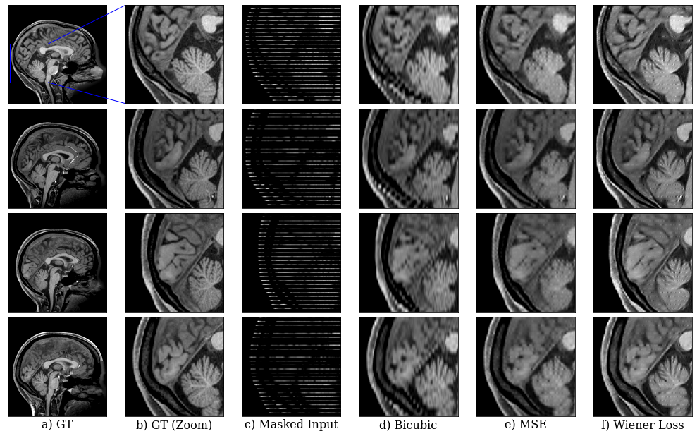
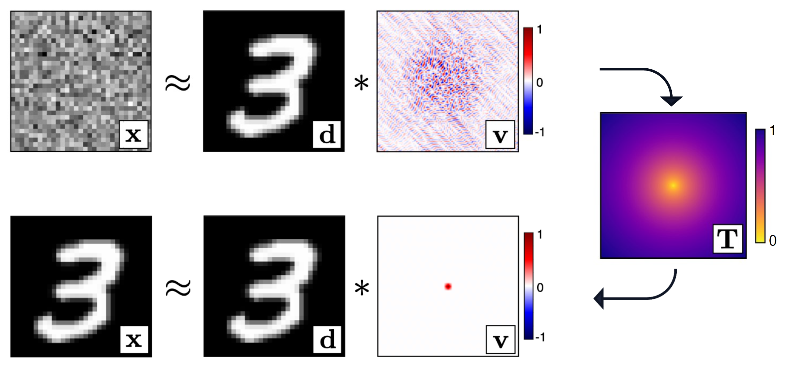

# Adaptive Wiener Loss

Data comparison lies at the heart of machine learning: for many applications, simplistic loss
functions - such as the L2 loss that rely on local element-wise differences between samples - have
taken preference. Such metrics are notorious for producing low-quality results. The proposed Adaptive Wiener Loss (AWLoss) addresses this issue by introducing a new convolutional approach to data comparison; one that uses a Wiener filter approach to naturally incorporate global information and promote spatial awareness within the compared samples. 


This repository contains an implementation of this loss in a natural [`Pytorch`](https://github.com/pytorch/pytorch) as here it is promoted as a loss function to drive deep learning problems. The source code is a single file that contains a single class named [`WienerLoss`](awloss/awloss.py). Its usage and customisation are described below.

A demonstration of this loss in a deep learning context is shown in the following figure for a medical data imputation problem:



In the figure, (e) and (f) are obtained through the training of a UNet.


## Installation
```
git clone https://github.com/dpelacani/WienerLoss.git
cd WienerLoss

# create conda environment (recommended)
conda create --name wiener
conda activate wiener

# install dependencies
pip install -r requirements.txt

# for running examples and performance notebooks
pip install -r requirements-optional.txt

# install package
pip install -e .
```

## Example usage
```
import torch
from wiener_loss import WienerLoss

wiener_loss = WienerLoss()
x = torch.rand([1, 3, 28, 28])
y = torch.rand([1, 3, 28, 28])

wiener_loss(x, y)
>> tensor(1.4073, grad_fn=<DivBackward0>)

wiener_loss(x, x)
>> tensor(0., grad_fn=<DivBackward0>)
```

## Method Overview
The main idea behind this comparison method, firstly introduced by [Warner and Guasch (2014)](https://www.s-cube.com/media/1204/segam2014-03712e1.pdf), is that two signals are considered identical when their corresponding matching filter is an dirac delta at zero lag (i.e. convolutional idendity). We start by considering two signals, $\mathbf{x}$ and $\mathbf{d}$, that are not identical. A convolutional Wiener filter $\mathbf{v}$ that provides the best least squares match between the two samples is computed by the well known equation:

$$
\mathbf{v} = (\mathbf{D}^{T} \mathbf{D})^{-1} \mathbf{D}^{T} \mathbf{x}
$$

where $\mathbf{D}$ is the Toeplitz matrix of signal $\mathbf{d}$ that achieves a convolution operation in matrix form.

We then act on this filter through an arbitrary a penalty function $\mathbf{T}$ that rewards energy at zero lag, and monotonically penalises energy at non-zero lags:

$$
L = \frac{1}{2}||\mathbf{T} * (\mathbf{v} - \mathbf{\delta)}||^{2}_{2}
$$

By minimising $L$, we implicitly drive signal $\mathbf{d}$ to become more similar to signal $\mathbf{x}$



## Input Arguments (needs updating)
On object initialistion:

    Args:
        method, optional
            "fft" for Fast Fourier Transform or "direct" for the
            Levinson-Durbin recurssion algorithm. Defaults to "fft"
        filter_dim, optional
            the dimensionality of the filter. This parameter should be
            upper-bounded by the dimensionality of the data. If data is
            3-dimensional and filter_dim is set to 2, one filter is computed
            per channel dimension assuming format [B, NC, H , W]. Current
            implementation only supports filter dimensions for 1D, 2D and 3D.
            Defaults to 2
        filter_scale, optional
            the scale of the filters compared to the size of the data.
            Defaults to 2
        reduction, optional
            specifies the reduction to apply to the output, "mean" or "sum".
            Defaults to mean
        mode, optional
            "forward" or "reverse" computation of the filter. For details of
            the difference, refer to the original paper. Default "reverse"
        penalty_function, optional
            the penalty function to apply to the filter. If None, a Gaussian
            penalty will be created of mean zero and standard deviations
            specified below. Mutually exclusive with "std". Default None
        store_filters, optional
            whether to store the filters in memory, useful for debugging.
            Option to store the filers before or after normalisation with
            "norm" and "unorm". Default False.
        epsilon, optional
            the stabilization value to compute the filter. Default 1e-4.
        std, optional
            the standard deviation value of the zero-mean gaussian generated
            as a penalty function for the filter. If 'penalty_function' is
            passed this value will not be used. Default 1e-4.

On object calling

    Args:
        recon
            the reconstructed signal
        target
            the target signal
        epsilon, optional
            the stabilization value to compute the filter. If passed,
            overwrites the class attribute of same name. Default None.
        gamma, optional
            noise to add to both target and reconstructed signals
            for training stabilization. Default 0.
        eta, optional
            noise to add to penalty function. Default 0.

## Note on Filter Dimensions (needs better formatting)
The `WienerLoss` class supports data of dimensions up to 3. The dimensionality of the filter is inferred from the size of the input.

[batch, channels, length] -> 1D filters

[batch, channels, height, width] -> 2D filters

[batch, channels, depth, height, width] -> 3D filters

Note that in all cases there exists on filter per channel per sample in the batch.

## Example Notebooks:
!! Need updating!